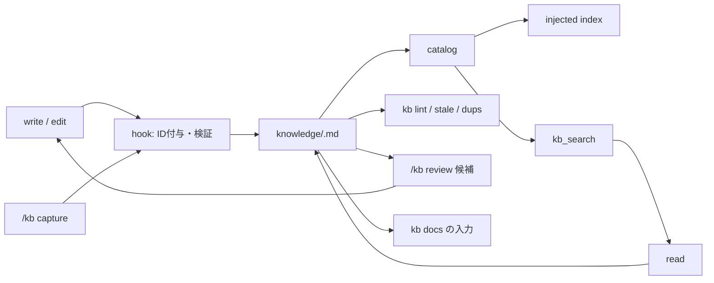

# 設計 — pi-knowledge

読者は pi-knowledge を実装・運用する開発者と AI エージェントです。共通の哲学は `PHILOSOPHY.md`、検証可能な制約と変更手順は `AGENTS.md` に書きます。本書は要求から設計を導出し、各設計に要件 ID と検証を対応づけます。

## 1. 概要

プロジェクトの再利用可能な知識を、エージェントが発見・適用・蓄積できるようにする pi プラグインです。知識は Git 管理の Markdown で、プラグインは実行時依存ゼロで動作します。

### 1.1 既定動作

| 項目 | 既定 |
|---|---|
| スコープ | project のみ(user は設定で追加) |
| エントリ | `knowledge/<id>.md` の自己完結ノート |
| ID | プラグインが付与する `hex8`。不変 |
| 注入 | 有効。固定文 + 索引。実効予算 min(4,000, max(1,000, 文脈窓×2%)) |
| 検索 | lexical(既定)/ FTS5 / embedding / hybrid を選択できる。タグ・status・scope で絞れる |
| 書き込み | `write` / `edit` を hook が検証。専用ツールなし |
| キャプチャ | `manual`(コマンド実行時のみ) |
| 整理 | `/kb review` が重複・stale 候補をモデルに提示。適用は通常の `write` / `edit` |
| document index | 生成のみ。注入しない |
| CLI | `kb` bin。list / tags / find / search(lexical) / lint / stale / dups / refs / docs / bench。lint は CI の必須ゲート |
| 実行時依存 | なし(Node 組み込みのみ) |

### 1.2 処理の流れ



既定フロー:

- 読み出し: injected index または `kb_search` の結果から `read` で本文を読む。
- 書き込み: `write` / `edit` → hook が ID 付与と検証 → catalog 更新 → 次セッションの索引に反映。
- キャプチャ: `/kb capture` → 通常の agent turn → 上記の書き込み経路。
- 整理: `/kb review` → 重複・stale 候補をモデルへ提示 → モデルが `read` して `write` / `edit` で適用。

### 1.3 対象外

- 会話のエピソード記憶。
- 自動キャプチャ。v1 は `off` と `manual` のみ。
- チーム共有 root への書き込み。team root は常に read-only です。
- document index のシステムプロンプト注入。

## 2. 要件

### 2.1 機能要件

| ID | 要件 |
|---|---|
| FR1 | セッション開始時に索引を注入し、既存知識の存在に気付ける |
| FR2 | 索引・検索から本文を読み、結論・条件・根拠を適用できる |
| FR3 | エージェントと人間が通常の `write` / `edit` で知識を追加・更新できる |
| FR4 | 書き込み時に形式・参照・上書きを検証する |
| FR5 | 語彙・タグ・status・scope で検索でき、方式を選択できる |
| FR6 | セッションの知識化を任意に実行でき、無効化できる |
| FR7 | 参照切れ・陳腐化・重複を検出できる |
| FR8 | 外部文書の索引を生成できる |
| FR9 | pi 外と CI で同じ検証を実行できる |

### 2.2 非機能要件

| ID | 要件 | 目標 |
|---|---|---|
| NFR1 | 常時コンテキストコストを予算内に保つ | §10 |
| NFR2 | 必須の外部プロセス・DB・サービスを持たない | 実行時依存ゼロ。lexical のみで完結 |
| NFR3 | 起動・検索・検証が会話を待たせない | §17 |
| NFR4 | project 単位で分離し、user スコープを追加できる | §5 |
| NFR5 | 部分故障でセッションを止めない | §19 |

### 2.3 制約

- 専用 write ツールを作らない。`write` / `edit` と hook で実現する。
- 知識は Git 管理のプレーンテキストとする。
- Node 22.19 以降の組み込みのみ。ビルド工程を持たない。

## 3. 設計方針

| 方針 | 内容 |
|---|---|
| 知識は自己完結 | 1エントリ=1知識。結論・条件・根拠・不確実性を要約して持つ。原文の転載はしない |
| 発見は索引、適用は本文 | 常時注入は1行の索引に限る。本文は必要時に読む |
| 不変条件は所有者が生成・強制する | 形式はプラグインが定義し、ID もプラグインが付与する(§5.3) |
| 編集能力を維持する | モデルには `write` / `edit` を使わせ、hook は検証と正規化だけを行う |
| 規定しきれない機能は入れない | 半端な機能は矛盾を生む。全契約を書ける機能だけを採用する |
| 計測して選ぶ | 検索方式と予算は bench で決める(§9、§17) |
| 失敗は検知・隔離・回復で定義する | 全故障に検知方法と回復手段を持たせる(§19) |

## 4. 用語

### 4.1 設計用語

| 用語 | 定義 |
|---|---|
| entry | 1知識を表す `knowledge/<id>.md`。root 直下の `.md` のみ |
| id | エントリの識別子。ファイル名から `.md` を除いた部分(§5.3) |
| root | エントリを格納するディレクトリ(§5) |
| scope | root の帰属。`project` / `user` / `team`(共有・read-only 用) |
| shadow | 同一 id が複数 root にあり、優先度の低い側が採用されない状態 |
| catalog | 全エントリの frontmatter とファイル情報の現在状態(§8) |
| search index | catalog と本文から作る検索用データ(§8) |
| injected index | セッション開始時に固定した索引テキスト(§8、§10) |
| document index | `kb docs` が生成する外部文書の索引(§12) |
| source | エントリの出典。URL またはリポジトリ内パス |
| link | 本文中の `[[id]]` 参照。`supersedes` はライフサイクル専用 |
| hook | pi が発火するイベント(`tool_call` 等)に登録する処理(§7) |
| frontmatter | ファイル先頭の `---` で囲んだ YAML メタデータ |
| atomic | 1エントリに独立した知識を1つだけ書くこと |
| 自己完結 | エントリ単体で結論・条件・根拠・不確実性が理解できること |
| 実効予算 | 注入に使えるトークン上限(§10.4) |
| dirty | 派生データが古くなり再構築を要する状態 |

### 4.2 外部用語

| 用語 | 定義 |
|---|---|
| file tools | pi の `read` / `grep` / `find` / `ls` |
| structuredContent | pi ツール結果の構造化フィールド。codemode 等が受け取る |
| details | pi ツール結果の描画・状態復元用フィールド |
| fallbackReason | 検索 backend を落とした理由の固定文字列(§9.1) |
| BM25 | 語彙検索の標準スコア。本設計はクラス別重みの近似を使う |
| RRF | Reciprocal Rank Fusion。複数順位の融合(§9.1) |
| embedding | テキストをベクトル化して意味類似で検索する方式 |
| recall | 過去の会話文脈から関連知識を想起させること(§10.5) |
| MRR | 平均逆順位。bench の指標(§9.4) |
| mtime+size | ファイルの更新時刻とサイズ。キャッシュ鍵 |
| custom message | pi の会話に挿入するカスタム種別メッセージ |
| followUp | ストリーミング中にメッセージを次ターンへ積む指定 |
| agent turn | ユーザー入力から assistant 応答完了までの1往復 |
| contextWindow | 現在モデルの文脈窓サイズ |
| trust | pi がプロジェクト設定の読み込みを許可する状態 |
| type stripping | Node が型注釈を除いて TS を直接実行する機能 |
| erasableSyntaxOnly | 型注釈のみ許可し実行時構文を禁止する TS 設定 |
| whitelist | 配布物に含めるファイルの列挙 |

## 5. スコープと保存

```json
{
  "roots": [
    { "path": "knowledge", "scope": "project", "priority": 100, "readonly": false }
  ]
}
```

### 5.1 root のフィールド

| フィールド | 型 | 既定 | 制約 |
|---|---|---|---|
| `path` | string | 必須 | cwd 基準の相対パスまたは `~` 展開。ディレクトリでなければ警告して無効化 |
| `scope` | string | `"project"` | `project` / `user` / `team`。他は設定警告 |
| `priority` | integer | 100 | 1以上。同順位は記載順 |
| `readonly` | boolean | false | true なら書き込みを常にブロック |

### 5.2 解決規則

- cwd はセッションの作業ディレクトリ。相対パスは cwd 基準で解決する。
- `roots` 未設定かつ `knowledge/` があれば project root 1つ。user root は明示設定時のみ。
- 解決後パスが同一または包含関係にある root は設定警告とし、包含される側を無効化する。symlink は解決後パスで判定する。
- 存在しない root は警告して無効化する。全 root が無効なら知識機能は no-op になる。
- `roots: []` も no-op とする。
- 同一 scope の root が複数ある場合は優先度の高い1つだけを有効化し、他は設定警告で無効化する。有効 root は最大3つ(project / user / team 各1)。
- 設定マージはグローバル→プロジェクトの順で項目単位。`roots` は配列ごと置換する。

### 5.3 id 衝突と shadow

- 同一 id が複数 root にある場合、優先度の高い root を採用する。
- 表示は常に `scope:id`(例 `user:a1b2c3d4`)とし、読み出し先は §5.4 の規則で解決する。
- lint はエラーにする。shadow される id への書き込み(create / edit)はブロックする。
- 衝突 id への書き込みだけをブロックし、無関係 id には影響しない。

### 5.4 読み出し先の解決

| 状況 | 規則 |
|---|---|
| root が1つ | 索引行は `id`。読み出し先は Roots 行の `dir` から `<dir>/<id>.md` |
| root が複数 | 索引行は `scope:id`。読み出し先は同じく `<dir>/<id>.md` |
| `[[id]]` | 解決関数で優先度順に検索。見つかった root のファイルを指す。shadow なら優先側。lint は shadow を警告 |
| `[[scope:id]]` | 指定 scope の root に限定する。存在しなければ参照切れ |
| `kb_search` の結果 | `path` フィールドに repo 相対または絶対パスを含め、モデルはそれを `read` する |

- 固定文の `Roots: scope=<path>` 行のみが scope とディレクトリの対応を持つ。`<path>` は設定に書いた表示用パス(相対または `~`)で、空白・`=`・`]` を含む path は設定警告として無効化する。索引行は root が1つなら `id`、複数なら `scope:id`。読み出しは解決済みパスで `<dir>/<id>.md`。
- 同一 id の共存は lint エラー。`[[id]]` が shadow に解決される参照は lint 警告とする。

### 5.5 書き込み先の解決

- 検証と正規化の対象は、設定 root の内側の `.md` だけとする。root 外のファイルには干渉しない(§7.1)。
- 対象が readonly root ならブロックする。
- 新規作成は、要求パスが属する root の直下 `<root>/<id>.md` に正規化する(サブディレクトリは直下へ移す)。

## 6. エントリ形式

### 6.1 frontmatter

```markdown
---
title: "外部APIの応答はスキーマ検証してから使う"
when:
  - 外部APIを新しく呼び出すとき
tags: [api, validation]
status: active
review_after: 2027-03-31
source: docs/api.md
---

結論: 外部APIの応答は想定スキーマで検証してから使う。
条件・根拠・反例・不確実性を続けて書く。
```

| フィールド | 必須 | 役割 | 制約 | consumer |
|---|---|---|---|---|
| `title` | 必須 | 索引の見出し | 120字以内の文字列 | 索引行、`kb list` |
| `when` | 任意 | 適用条件(any-of) | 文字列1本または配列。5件・合計200字以内 | 索引行、recall |
| `tags` | 任意 | 決定論的フィルタ | 文字列の配列。重複は除去 | `kb_search`、`kb find`、dups |
| `status` | 任意 | ライフサイクル | `active`(既定) / `superseded` / `deprecated` | 注入・既定検索の除外 |
| `supersedes` | 任意 | 置換関係 | id または `scope:id` | refs、lint |
| `review_after` | 任意 | 再確認期限 | `YYYY-MM-DD`。比較は UTC | stale |
| `source` | 任意 | 出典 | URL またはリポジトリ内パス | 人間の検証、lint |

- 未知フィールドはファイルに残るが catalog では無視し、lint が警告する。
- frontmatter はプレーンスカラー、引用文字列、インライン配列、ブロックリストのみ。行頭 `#` の行はスキップし、インライン `#` とアンカーは解釈せず文字列として扱う。ネスト mapping・予期しないインデント・ブロックスカラー(`>` / `|`)はエラーにする。
- `status` が `active` 以外のエントリは注入と既定検索から除外し、status 指定でだけ返す。
- frontmatter を持たない `<hex8>.md` は entry にせず、lint は error にする。

### 6.2 本文と参照

- 本文は結論を先頭に、条件・根拠・反例・不確実性を要約して書く。
- 参照は `[[id]]`、スコープ固定は `[[scope:id]]`。解決規則は §5.4。
- `supersedes` は置換専用で、一般参照には使わない。
- 出典 URL は結論の根拠として本文に直接書く。`source` は文書全体の出典を示す。

### 6.3 ID

| 契約 | 内容 |
|---|---|
| 定義 | ファイル名から `.md` を除いた部分。frontmatter に `id` フィールドを置かない |
| 形式 | `<hex8>`(小文字 hex 8桁、32bit 乱数) |
| 生成 | プラグインが `write` hook で付与する。モデルは乱数を生成しない |
| 一意性 | 生成時に既存ファイルを確認し、衝突したら最大10回再試行する。失敗時は書き込みをエラーにする |
| 不変性 | 通常運用でリネーム禁止。同一パスの merge 衝突は Git の conflict として解決する(§19) |
| 可読性 | 意味は `title` が担う。ID に内容や日付を含めない |
| 順序 | catalog は id の辞書順(決定性のため。意味は持たせない) |

- 作成日時は Git が保持する。作成順は `git log --diff-filter=A -- knowledge/` で得る。
- 衝突確率の根拠: 独立した2ブランチが各1,000件を追加したとき、同一 id が衝突する確率は約0.02%(各ペア独立、32bit)。生成時の確認は merge 済みファイルには効かないため、同一パスの衝突は Git の conflict として発生し、ユーザーが解決する(§19)。

## 7. 書き込み経路

| 経路 | 検証点 | 動作 |
|---|---|---|
| `write` | `tool_call` でパスと `input.content` | root への新規作成のみ許可。規定形式でないパスは ID を付与して書き換える。既存エントリはブロック |
| `edit` | 適用後本文を計算して解析 | 形式エラーはブロック、警告は通す。frontmatter 非接触は高速パス |
| `bash` 等 | `tool_result` 後の mtime/size 変化 | 警告と catalog 更新のみ |
| セッション開始 | 全エントリ | 警告を集約通知する |

### 7.1 補足条件

- ID 付与: `node:crypto` で生成し、`input.path` を `<root>/<id>.md` に書き換える。実パスは `tool_result` で通知する。
- 上書き防止: 更新は `edit` のみ。`write` の既存エントリ上書きは常にブロックする。
- ブロック理由: `{block:true, reason}` に違反項目と修正条件を含める。
- 緩和範囲: `write.enforce: "warn"` は形式エラーのみ警告に緩和する。上書き・readonly・shadow は緩和しない。
- 検証対象: 設定 root 内の `.md` のみ。ルート外と他拡張子には干渉しない。
- hook の異常: tool schema 不一致・`input` 欠落・root 解決不能・hook 例外のときは介入せず、pi の既存動作に任せる(ファイルは壊さない)。root 解決不能が知識パスの書き込みならエラー理由を返す。
- 並行性: ファイル書き込みは `write` / `edit` に任せる。プラグインは入力を書き換えるだけでファイルを書かない。
- 最終防衛線: `bash` 経由と外部変更は session_start の全検証と CI の `kb lint` が拾う。

### 7.2 検証レベル

**エラー(既定でブロック。`warn` では保存を許すが、その entry は catalog・検索・注入から除外する)**

- frontmatter が解析不能、または mapping でない
- `title` が存在しない、空、または文字列でない
- `when` / `tags` / `status` / `review_after` / `source` の型が不正
- `status` が許可値でない
- `review_after` が `YYYY-MM-DD` でない
- ルート間の id 衝突に触れる書き込み
- 新規 `write` のパスに既存エントリがある
- readonly または shadow される id への書き込み

**警告(保存を許可して通知)**

- `title` >120字、`when` 合計 >200字、`when` >5件
- 本文が空、または50字未満
- `[[id]]` の参照先がない
- `supersedes` の参照先がない
- `source` のリポジトリ内パスが存在しない(URL は検査しない)
- `review_after` 超過
- 類似エントリが存在する
- 未知の frontmatter フィールドがある
- `supersedes` で指されたエントリが `active` のままである
- ファイル名が `<hex8>` でない、またはサブディレクトリにある(entry にしない)

- `write.enforce` は実行時の hook 方針。CLI の `kb lint` は常にエラーを報告し、エラーありで終了コード1。catalog から除外されたエントリは `kb lint --invalid` で一覧できる。

## 8. 読み出しと派生データ

| 概念 | 内容 | 更新 |
|---|---|---|
| catalog | frontmatter とファイル情報(本文を含まない) | session_start で全構築、書き込みで該当分を更新 |
| search index | catalog と本文から作る検索用データ | 書き込みで dirty 化、次回検索で遅延再構築 |
| injected index | session_start の catalog から凍結した索引 | session_start のみ。セッション中は不変 |

- セッション中の書き込みは catalog と search index に反映し、injected index は次セッションまで更新しない。プロンプトキャッシュの prefix を保護するためである。
- 再読込・再開・fork では session_start から再構築する。

## 9. 検索

### 9.1 方式

```json
{
  "search": {
    "backend": "lexical",
    "embedding": {
      "endpoint": "https://...",
      "model": "...",
      "apiKeyEnv": "KNOWLEDGE_EMBEDDING_KEY",
      "timeoutMs": 5000
    }
  }
}
```

| backend | 実装 | 可用性 |
|---|---|---|
| lexical | 文字クラス別重みの BM25 近似。既定 | 常時 |
| fts5 | `node:sqlite` の FTS5 | session_start の機能検出に成功したときのみ |
| embedding | 設定エンドポイントのコサイン類似。キーは環境変数名のみ | 初回検索時に遅延確認 |
| hybrid | lexical と embedding の RRF(順位融合) | 両方利用可能なときのみ |

- フォールバック先は常に lexical。失敗時は `backend` に実使用値、`fallback: true`、`fallbackReason` を details / stderr / JSON に出す。黙って切り替えない。
- `fallbackReason` は `unavailable`(未設定・接続不可) / `auth`(401/403) / `network`(DNS・TLS・timeout) / `rate_limited`(429) / `server`(5xx) / `protocol`(不正応答・次元不一致) のいずれか。
- FTS5 は検出失敗・初期化失敗・クエリ失敗のいずれでも lexical へ落とす。
- ツールはフォールバックを許可する。厳格指定は CLI の `--require-backend` に限る。
- embedding 利用時はエントリ本文が外部へ送信される。README に明記する(§18)。

### 9.2 入力と結果

`kb_search` の入力:

| 引数 | 型 | 既定 | 規則 |
|---|---|---|---|
| `query` | string | なし | `tags` と両方空ならエラー |
| `tags` | string[] | なし | 全タグ一致(AND) |
| `status` | `"active"` / `"any"` / `"superseded"` / `"deprecated"` | `"active"` | `any` は全 status |
| `scope` | string | なし | `project` / `user` / `team` を指定。省略時は全 root |
| `backend` | string | 設定値 | その呼び出しだけ設定を上書き |
| `limit` | integer | 10 | 1〜50 |

結果型は `{ id, scope, title, when, tags, status, source, path, score, backend, fallback?, fallbackReason? }`。`score` は 0〜1 の同一 backend 内の順位付け専用で、backend 間で比較しない。`path` は `read` に渡せる実パス。同点は id の辞書順で決める。

- search index は初回検索時に遅延構築し、frontmatter と本文(1件64KBで打ち切り)を対象にする。本文にだけ一致するエントリも検索できる。
- 更新は mtime+size をキーにした差分とし、変わったエントリだけ再構築する。
- モデル向け `content` は最大3,000トークン。各行は tags と最大200字の本文抜粋を含む。超える場合は件数を減らし、その旨を明記する。
- 完全データは structuredContent で返す(モデルのコンテキストには入らない)。

### 9.3 索引と result の上限

| 対象 | 上限 | 超過時 |
|---|---|---|
| 1エントリの索引対象本文 | 64KB | 打ち切って索引し、結果に注記する |
| structuredContent | なし(呼び出し元の責任) | - |
| モデル向け content | 3,000トークン | 件数を減らして注記する |
| 表示件数 | 50件 | `limit` で制御 |

### 9.4 計測

`kb bench` がフィクスチャ `[{"query": "...", "expect": ["<id>"], "tags": []}]` に対し、backend 別の recall@1/3/5・MRR・レイテンシ(p50/p95)・索引構築時間・推定/実測トークン比を JSON で出力する。結果は `docs/bench/` に記録し、採用 backend はこの計測で決める。

## 10. 注入とトークン予算

### 10.1 注入物

| 注入物 | タイミング | 予算 |
|---|---|---|
| 固定文 | 毎リクエスト | ≤ 110 トークン |
| `Roots:` 行 | 毎リクエスト | ≤ 50 トークン(有効 root 最大3) |
| 索引の1行 | 毎リクエスト | 典型 88 / 最悪 493 トークン(§10.3) |
| `kb_search` のツール宣言(provider へ送る JSON Schema を含む) | 毎リクエスト | ≤ 500 トークン |
| `knowledge-curation` のスキルブロック(pi が注入する name + description + location + 定型文) | 毎リクエスト | ≤ 300 トークン |
| lint サマリ(`knowledge_lint` custom message) | session_start ごとに1回 | ≤ 300 トークン(常時予算に含めない) |
| recall ヒント | 一致ターンのみ。既定 off | ≤ 60 トークン(常時予算に含めない) |

索引を除く常時固定オーバーヘッドは文書上限で 110 + 50 + 500 + 300 = 960 トークンです。実測は 105(固定文) + 9(Roots 1個) + 469(ツール宣言) + 269(スキル) = 852 トークンです。ツール宣言は provider の function calling、スキルブロックは pi が注入する分も会計に含めます。固定文・ツール宣言・スキル説明はパッケージ定数とし、contract test が各トークン上限を検証します。超過したパッケージはリリースしません。document index は注入しません。検索結果の上限は §9.3 です。

固定文(英語):

> ## Project Knowledge
>
> This list is a discovery index. Read the entry file before applying it: `<dir>/<id>.md` per the Roots line. The body holds the conclusion, conditions, counterexamples, and evidence. Fix outdated entries in place; add an entry when work yields reusable knowledge.

固定文の末尾に `Roots: scope=path` の1行を常に付けます(有効 root は最大3)。パスが長いときは 32 字で `…` 切り詰めます。root が1つなら索引行は `id`、複数なら `scope:id` とし、読み出しは解決済みパスで `<dir>/<id>.md`。

### 10.2 推定

トークン数は文字クラスで係数が変わります。日本語は約1〜1.5トークン/字、ASCII 英字は約3〜4字/トークン、数字と hex は1〜2字/トークン、記号は約1字/トークンです。pi の `estimateTokens`(文字数/4)は日本語でも数字・hex でも過小評価します。

本プラグインは保守推定 `ceil(ASCII英字/3 + ASCII数字・記号/2 + 非ASCII×1.5)` を使い、推定 ≥ 実測に倒します。係数は `kb bench` の実測比で更新します。

### 10.3 索引1行のコスト

`id-title — when` の内訳。典型と p95 は34件のフィクスチャ実測の初期値で、bench が更新します。複数 root では id 表記が `scope:id` になり、+5〜15字(≤6トークン)です。

| 構成要素 | 上限(字) | 最悪(トークン) | 典型(トークン) | p95(トークン) |
|---|---|---|---|---|
| id 表記(`hex8` または `scope:id`) | 21字 | 10 | 4 | 4 |
| 区切り | 約6字 | 3 | 3 | 3 |
| `title` | 120字 | 180 | 27 | 50 |
| `when`(連結後) | 200字 | 300 | 54 | 78 |
| **合計** | 347字 | **493** | **88** | **135** |

- 最悪値は切り詰め後の上限字数(`title` 120字 / `when` 合計200字)から計算した値。
- 「上限」列は字数、それ以外は保守推定トークンです。
- 描画時に `title` は120字、`when` は合計200字で切り詰め、`…` を付ける。
- 実効予算 4,000 のとき、固定費(ツール500 + スキル300)とヘッダ実測約110(固定文105 + Roots 9)を引いた約3,100が索引行に使えます。典型では約35行、最悪では約6行です。Roots が長い場合はその分減ります。縮退は通常動作です。

### 10.4 予算と縮退

実効予算は `min(injection.maxTokens, max(injection.floorTokens, contextWindow × injection.contextFraction))`。`contextWindow` 不明時は `maxTokens` を使います。既定は 4,000 / 1,000 / 0.02 で、文脈窓 200k なら 4,000、100k なら 2,000、32k なら 1,000。

- 設定値の検証: 0以下・非数値・`contextFraction` が 0以下または 1超は警告して既定値。`floorTokens > maxTokens` は `floorTokens = maxTokens` に補正し、警告は出さない。
- 超過時は session_start で段階を選び、採用段階と推定トークンを `/kb status` と通知に出す。pointer でも収まらない場合はタグ行→件数行→ヘッダのみの順に削る。固定費が実効予算を超える設定ではヘッダのみを注入し、`overBudget` を `/kb status` に表示する。

| 段階 | 内容 |
|---|---|
| full | `id title — when` |
| title | `id title`(title 60字)。`when` は検索と本文で判断する |
| pointer | 件数、タグ一覧、`kb_search` の案内のみ |

- 索引は session_start で凍結し、`before_agent_start` が毎回同じ値を `systemPromptOptions.sections.knowledge_index` に再設定する。options は毎回正規化されるため、前回の設定が残る前提にしない。
- モデル・設定の変更は次セッションから反映する。`injection.enabled: false` なら注入しない。

### 10.5 recall ヒント

`recall.mode: "hint"` は `before_agent_start` のユーザープロンプトを catalog と字句照合し、上位3件までの `id`(複数 root では `scope:id`)を custom message(`customType: "knowledge_recall"`)としてその run だけに追加します。同一セッションで hint 済みの id は再注入しません。永続化は保証せず、再開時は再度注入され得ます。上限3件で60トークン以内に収まります。

### 10.6 lint サマリ

session_start ごとに1回、lint の error / warning が1件以上あるときだけ `pi.sendMessage` で `knowledge_lint` custom message を送ります。上位8件と残件数、修正指示を含みます。モデルはユーザーの `/kb lint` 実行を待たずに修正へ着手できます。常時予算には含めません。session_start の reason が `resume` / `fork` / `reload` の場合は同じセッション文脈で再度送られることがあります(セッション開始ごとに最大1回)。

## 11. 品質管理

### 11.1 lint

§7.2 の検査を hook、`/kb lint`、CLI で共有する。CLI はエラーありで1、警告のみで0。

### 11.2 参照

本文の `[[id]]` と `supersedes` から参照グラフを作る。`/kb refs <id>` は採用 root(§5.3)の被参照を表示する。

### 11.3 陳腐化

- `review_after` 超過を session_start と `/kb stale` が報告する。
- Git 最終更新日が `stale.days`(既定365)超のエントリも報告する。Git 不在・非リポジトリ・shallow clone は警告してスキップする。

### 11.4 重複と矛盾

- `/kb dups` が title・when・tags・本文の字句類似で重複候補を出す。
- `/kb review [focus]` が重複候補と stale 候補を `pi.sendUserMessage` でモデルに渡し、統合・superseded 化・レビュー日更新を提案させます。モデルは通常の write/edit で適用し、hook の検証を通ります。自動書き換えはしません。候補は重複上位5件と stale 上位10件に制限します。

## 12. document index

外部文書の発見用に、`kb docs` が生成する索引です。注入はしません。

| 契約 | 内容 |
|---|---|
| 生成物 | 1行 = `<repo相対パス> — <説明>`。説明は先頭20行以内の最初の `#` 見出し(Markdown 記号を除く)。見出しがなければパスだけを書く |
| 行の正規化 | 改行・制御文字は除去し、120字で切り詰める。説明に `—` は使わない |
| 順序 | パスの辞書順 |
| 対象 | `docs.include` の各 glob に一致し `docs.exclude` に一致しないファイル。`include: []` は対象0件。生成物自身は常に除外 |
| glob | repo 相対パスの `*` / `**` / `?` のみ。大文字小文字は区別する。不正な記法は設定警告として無効化 |
| 除外 | バイナリ(先頭8KBに NUL)、ドットファイル、`.git`、`node_modules`、symlink。symlink は辿らず行にも出さない |
| 読み込み失敗 | 該当ファイルをスキップして警告。10%超が失敗ならエラー(終了コード2) |
| 上限(`docs.maxLines`) | 末尾注記を含めて500行を超えない(499行+注記) |
| 読み出し | `read` に repo 相対パスを渡す。URL は `source` にのみ書ける |
| `--check` | ファイル未生成・内容差分は終了コード1。読み込み失敗は2 |
| 0件 | ファイルを生成せず通知し、終了コード0 |

- `docs.path` の親ディレクトリが無ければ作成する。書き込み失敗はエラー(終了コード2)。
- 列挙中にファイルが消えた場合は警告してスキップする。

## 13. キャプチャ

| mode | 動作 |
|---|---|
| `off` | 無効。`/kb capture` は無効と通知して何もしない |
| `manual`(既定) | `/kb capture [focus]` が `pi.sendUserMessage()` で指示を送り、通常の agent turn を1回発生させる。入れ子モデル呼び出しはしない。ストリーミング中は `deliverAs: "followUp"`。送信失敗は通知して中断 |

抽出の判断(何を知識にするか、原子性、重複確認、`source` の書き方)は同梱スキル `knowledge-curation` に置く。ファイル名はプラグインが付与するため任意でよい。自動キャプチャは設計対象外(§1.3)。

## 14. CLI と CI

`kb` bin は TS を直接実行する。ビルド工程なし(Node 22.19.0 以降の type stripping と `erasableSyntaxOnly`。CI は 22.19 と 24)。

| コマンド | 出力 | 終了コード |
|---|---|---|
| `kb list [--all]` | 有効エントリの一覧。`--all` は非 active も含む | 0 |
| `kb tags` / `kb find <tag>...` | タグ一覧 / AND 検索 | find は0件で1 |
| `kb search <query> [--json] [--status <s>] [--scope <s>] [--limit <n>]` | 検索結果。limit 上限50 | 0件は0 |
| `kb lint` | エラーと警告の一覧 | エラーありで1 |
| `kb stale` / `kb refs <id>` | 各一覧 | 0 |
| `kb dups [--max <n>]` | 重複候補の一覧。`--max <n>` は候補ペアが n 超で終了コード1、n が0以上の整数でなければ2 | 既定は0 |
| `kb docs [--check]` | document index の生成 / ドリフト検査 | check は差分ありで1。読み込み・書き込み失敗は2 |
| `kb bench` | backend 別計測(JSON) | 0 |
| `kb search --backend <b> --require-backend` | backend 指定と厳格化 | backend 不可かつ require で3 |

- 設定解決は `$PI_CODING_AGENT_DIR/knowledge.json` → `.pi/knowledge.json` の順。project は trust 時のみ読む。
- CI の最小構成は `kb lint` と `kb docs --check`。警告のみでは止めない。任意で `kb dups --max <n>` を追加できる。
- `/kb status` は pi コマンド(実装済み)。CLI の `kb status` は提供しない。

## 15. pi 統合面

| 種別 | 名前 | 備考 |
|---|---|---|
| イベント | `session_start` | catalog 構築、予算判定、lint サマリ(`knowledge_lint`)の送信と警告通知 |
| イベント | `before_agent_start` | injected index の再設定、recall ヒント |
| イベント | `tool_call` | ID 付与、書き込み前検証(ブロック可) |
| イベント | `tool_result` | 事後検証、catalog 更新、実パス通知 |
| ツール | `kb_search` | 読み取り専用。検索のみで書き込みは行わない |
| コマンド | `/kb` | status / config / lint / list / tags / find / search / stale / dups / refs / review / capture / docs / bench |
| スキル | `knowledge-curation` | 書き方・キュレーション・キャプチャ手順。pi がスキルブロック(name・description・location)を注入 |
| 設定 | `knowledge.json` | §16 |

- 閲覧は `read`、編集は `write` / `edit` をそのまま使う。モデル向けツールは `kb_search` の1つ。
- 全モード(tui / rpc / json / print)で動作する。UI 通知は `ctx.hasUI` でガードする。
- `kb_search` は root が無くても登録し、空結果と案内を返す。
- `enabled: false` は全機能を無効化し、`/kb status` だけを残す。
- 注入は `sections.knowledge_index` キーを使う。設定に失敗した場合は通知して注入なしで継続する。
- `/kb status` は enabled、有効 root、注入段階と推定トークン、backend、lint 件数を表示する。
- `/kb config` はマージと既定値を適用した解決済み設定を JSON で表示する。設定を変更するコマンドは持たず、設定は `knowledge.json` で変更する。

## 16. 設定スキーマ

```json
{
  "enabled": true,
  "roots": [{ "path": "knowledge", "scope": "project", "priority": 100, "readonly": false }],
  "injection": { "enabled": true, "maxTokens": 4000, "floorTokens": 1000, "contextFraction": 0.02 },
  "recall": { "mode": "off" },
  "search": { "backend": "lexical", "embedding": { "endpoint": "", "model": "", "apiKeyEnv": "", "timeoutMs": 5000 } },
  "capture": { "mode": "manual" },
  "write": { "enforce": "block" },
  "docs": { "path": "docs/INDEX.md", "include": ["docs/**"], "exclude": [], "maxLines": 500 },
  "stale": { "days": 365 },
  "cache": { "enabled": true }
}
```

- 不明なキーは無視。型不正・範囲不正は警告して既定値。壊れた設定でセッションを止めない。
- project 設定は trust 時のみ読む。

## 17. 性能

初期目標。`kb bench` の結果で更新する。

| 対象 | 初期目標 | 測定条件 |
|---|---|---|
| catalog 構築 | 1000件で100ms未満 | Node 24 / SSD / 本文1KB / warm |
| ローカル検索(典型) | p50 50ms・p95 150ms以内 | 1000件・本文1KB・キャッシュ済み |
| ローカル検索(最悪) | p95 500ms以内 | 1000件・本文64KB |
| search index 構築 | 1000件で150ms未満(典型)/ 1s未満(64KB) | 初回検索時 |
| 書き込み検証 | 典型10ms未満 | 対象1ファイル |
| bash 事後検証 | 1000件で20ms未満 | 全エントリ stat・変化分のみ解析 |
| 注入 | 索引以外 ≤960(実測 852、1 root)。固定費超過時はヘッダのみ+`overBudget` | 索引1行 典型88・最悪493トークン |
| embedding | ローカル処理と分離して報告 | API 往復は別計測 |

## 18. セキュリティとプライバシー

- プロジェクト設定は trust 時のみ読む。既定でネットワークを使わない。
- embedding は明示設定時のみ。本文が外部送信されることを README に明記し、キーは環境変数名だけを書く。
- ナレッジはリポジトリ内容と同等に信頼する。外部由来の文書をエントリ化する場合は `source` で出典を示す。

## 19. 失敗モード

| 失敗 | 検知 | 処理 | 回復 |
|---|---|---|---|
| 既存エントリへの `write` | `tool_call` | ブロック | `edit` を使う |
| 形式エラー | `tool_call` / lint | ブロック(既定)。`warn` は保存するが catalog から除外 | 修正して再試行 |
| ID 生成の再試行超過 | 生成時 | 書き込みエラー | 再試行し、失敗時は書き込みエラー(モデルは ID を生成しない) |
| 同一パスの add/add 衝突(merge) | Git / lint | Git の conflict としてユーザーが解決 | 片方を新 ID にリネームし、参照を手動更新する |
| `bash` 経由の変更 | `tool_result` の mtime | 警告、catalog 更新 | session_start 検証、CI lint |
| pi 外の変更 | mtime+size 不一致 | 該当分を再解析 | 次回検索で反映 |
| mtime+size が同じ外部変更 | 検知不能 | 制限として許容 | session_start / CI |
| FTS5 不可 | 機能検出/初期化/クエリ失敗 | lexical へフォールバック表示 | 継続 |
| embedding 失敗 | 初回検索 | `fallbackReason` を付けて lexical | 継続 |
| catalog 解析失敗 | 解析時 | 該当エントリを除外し警告 | 修正 |
| 注入予算超過 | session_start | 段階縮退 | 閾値調整または bench |
| 固定費が実効予算を超える | session_start | ヘッダのみを注入し `overBudget` を表示 | `injection.maxTokens` を増やす |
| 文脈窓不明 | session_start | `maxTokens` を使用 | 継続 |
| 設定不正 / 未信頼 | 読み込み時 | 警告して既定値。project は無視 | 修正 |
| hook の schema 不一致・例外 | `tool_call` | 介入せず pi に任せる | 継続 |
| root の権限不足・解決不能 | scan / write | 該当 root を無効化し警告。知識パスへの書き込みはエラー | 権限修正 |
| Git コマンド失敗 | stale | Git 日付をスキップし警告 | 継続 |
| document index の書き込み失敗 | `kb docs` | エラー(終了コード2) | 親ディレクトリ・権限を修正 |
| document index の対象 0件 | `kb docs` | 生成せず通知 | 継続 |
| 参照先の削除 | lint | 警告 | 参照修正または復元 |
| 重複エントリ | dups / lint | 警告 | 統合または superseded |
| `kb_search` の引数不正 | ツール呼び出し | エラーを返し修正を促す | 引数を修正 |
| lexical 索引の構築・本文読み取り失敗 | 検索時 | 該当エントリを除外し警告。検索は継続 | 修正 |
| injected index の設定失敗 | `before_agent_start` | 通知して注入なしで継続 | 再開・修正 |
| catalog 走査失敗 | session_start | 読めた root だけを使い警告 | 権限・設定を修正 |
| 書き込み後の catalog 更新失敗 | `tool_result` | dirty として次回再構築 | 次回検索で回復 |
| コマンド出力失敗(tags / find / refs / dups / bench) | コマンド | エラーを表示 | 引数・権限を修正 |
| document index の読み込み失敗 | `kb docs` | 10%以下はスキップ警告、超なら終了コード2 | 該当ファイルを修正 |
| glob 設定不正 | 設定読み込み | 該当パターンを無効化し警告 | パターンを修正 |
| 検索結果の `path` が読めない | `read` | モデルに読めない旨が返る | パス・権限を修正 |
| manual キャプチャ送信失敗 | コマンド | 通知して中断 | 再実行 |
| 非 UI モード | 実行時 | 通知を抑制 | 動作は同一 |

## 20. テストと検証

| 層 | 対象 |
|---|---|
| unit | frontmatter 解析・直列化、ID 生成と再試行、lint 各規則(未知フィールド・supersede を含む)、検索スコア、類似度、陳腐化(UTC)、設定解決と範囲補正、トークン推定、root 解決、書き込み先解決 |
| contract | ツール・コマンド・イベント・設定の表面、固定文・ツール宣言・スキルのトークン予算、runtime import が Node 組み込みのみ、`dependencies` 空、ビルド工程なし、配布物 whitelist、用語・設定キーの定義完全性 |
| integration | 要件対応表(下表) |
| perf | §17 の全行 |

| 要件 | 設計 | テスト |
|---|---|---|
| FR1 | §8、§10 | 索引注入、固定文、予算縮退、採用段階の報告、複数 root の scope 表記 |
| FR2 | §5.4、§6.2、§9 | 索引行と検索結果の `path` から `read` できる。本文は注入されない。`kb_search` の content が3,000トークン以下 |
| FR3 | §5.5、§6、§7 | `write` 新規作成と `edit` 更新、書き込み先解決、catalog/search への反映 |
| FR4 | §6、§7.2 | エラーでブロック、`warn` で catalog 除外、上書き・readonly・shadow は常にブロック、hook 異常時は非介入 |
| FR5 | §9 | backend 選択、tags AND、status、scope、limit、本文のみ一致、fallback 表示、fallbackReason の分類 |
| FR6 | §13 | off / manual の各動作。manual が通常 turn を1回発生させ、送信失敗で中断する |
| FR7 | §11 | 参照切れ、stale(Git 失敗含む)、dups、`kb refs` |
| FR8 | §12 | 生成、`--check`、0件、上限打ち切り、バイナリ除外、書き込み失敗 |
| FR9 | §14 | CLI と pi の設定解決・lint 結果の一致、終了コード |
| NFR1 | §10 | 常時固定費 ≤960(実測852)、行コスト典型/最悪、pointer クランプと overBudget、lint サマリ、検索 content ≤3,000 |
| NFR2 | §2.3、§9、§18 | runtime import が Node 組み込みのみ。lexical がネットワークなしで動く。FTS5 不可でも動く。embedding 未設定で送信がない |
| NFR3 | §17 | 全性能行の計測 |
| NFR4 | §5 | project 既定、user 明示時のみ、書き込み先解決、roots マージ、root 外非干渉 |
| NFR5 | §19 | 失敗モード表の各行がセッションを止めない |

## 21. 実装フェーズ

| Phase | 内容 | 完了条件 |
|---|---|---|
| 1 MVP (実装済み) | 解析・catalog・注入・lint・write/edit hook・capture(manual)・スキル・CLI list/tags/find/search(lexical)/lint・設定 | FR1–FR4、FR6、FR9、NFR1–NFR2、NFR4–NFR5 |
| 2 品質 (実装済み) | stale / refs / dups / docs、bench | FR7–FR8、性能目標 |
| 3 検証と拡張 (実装済み) | FTS5 / embedding / hybrid、user root の運用評価 | bench で backend を比較し採用を決定 |
| 4 共有 (実装済み) | readonly の共有 root(team)、索引の永続キャッシュ | 複数人運用で破綻しない |
| 5 自律キュレーション (実装済み) | lint サマリのモデル通知、`/kb review`(重複・stale 候補の判定と統合・superseded の提案) | 提案が通常の write/edit 経路で適用できる |

## 22. 未決事項

実装前に受け入れ条件を決めるものだけを残します。

| 未決 | 受け入れ条件 |
|---|---|
| 採用する検索 backend | `kb bench` の recall 改善幅と遅延・依存・プライバシー比較で決定 |
| token 推定係数 | bench の推定/実測比で更新。更新しても保守側を維持 |
| FTS5 の採用 | Node ビルドでの可用性と lexical に対する価値で決定 |

## 付録A 外部文書ポインタの研究

本文を持たず外部文書を指すだけのエントリは採用しません。判断の根拠を示します。

| 分類 | 研究 | ポインタの現れ方 |
|---|---|---|
| 自己完結カード | Knowledge Cards[13]、Decision-Aware Memory Cards[14]、A-MEM[5] | カード自身が検証済みの知識を持つ |
| 要約+ポインタ | Memex(RL)[15]、Pointer-Grounded Topic Memory[16] | 要約に index を付けて自動生成し、必要時に参照解決する |
| 索引ファイル | FS-Researcher[17]、Zettelkasten[4] | 目次・索引ノートを少数のナビゲーションとして分離する |
| 分離・生成 | OpenViking[2]、Basic Memory[3]、Claude Code Skills[1] | 外部知識と学習知識を分離し、索引は生成する |

手書きポインタの利点は、存在認知、低コストな追加、単一情報源、`when` の付与、非テキストの索引、検索メタデータ、原文の権威性、人間の選択です。これらは索引の利点であり、知識エントリの利点ではありません。利点は document index(§12)、自己完結エントリ + `source`、`AGENTS.md` のポインタで保全します。

## 出典

1. [Agent Skills best practices — Anthropic](https://platform.claude.com/docs/en/agents-and-tools/agent-skills/best-practices)
2. [OpenViking Context Types](https://docs.openviking.ai/en/concepts/02-context-types) / [Storage Architecture](https://docs.openviking.ai/en/concepts/05-storage)
3. [Basic Memory Note Format](https://github.com/basicmachines-co/basic-memory/blob/main/NOTE-FORMAT.md)
4. [Zettelkasten: Types of Notes](https://zk.zettel.page/types-of-notes.html)
5. [A-Mem: Agentic Memory for LLM Agents](https://arxiv.org/html/2502.12110)
6. [llms.txt](https://llmstxt.org/index.html)
7. [agentmap](https://github.com/remorses/agentmap)
8. [okf-lint](https://github.com/playcode/okf-lint) / [docrot](https://github.com/andimrob/docrot)
9. [mem0 entity-scoped memory](https://docs.mem0.ai/platform/features/entity-scoped-memory)
10. [Is Grep All You Need? (arXiv 2605.15184)](https://www.alphaxiv.org/abs/2605.15184)
11. [Filesystem-Based Memory for LLM Agents (arXiv 2607.26637)](https://arxiv.org/abs/2607.26637)
12. [Cursor Rules](https://cursor.com/docs/rules)
13. [Knowledge Cards: Structured Knowledge for AI Systems (arXiv 2608.26176)](https://arxiv.org/abs/2608.26176)
14. [Decision-Aware Memory Cards (arXiv 2606.08151)](https://arxiv.org/pdf/2606.08151v1)
15. [Memex(RL): Indexed Experience Memory (arXiv 2603.04257)](https://arxiv.org/html/2603.04257v1)
16. [Pointer-Grounded Topic Memory (Zenodo 2026)](https://doi.org/10.5281/ZENODO.19236574)
17. [FS-Researcher: File-System-Based Agents (ACL 2026)](https://aclanthology.org/2026.acl-long.288.pdf)
